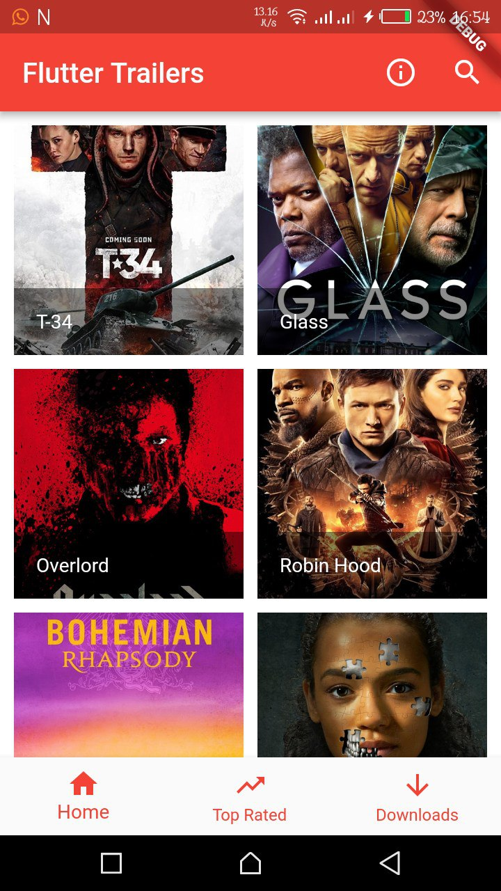
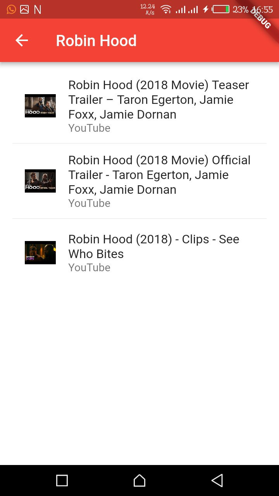
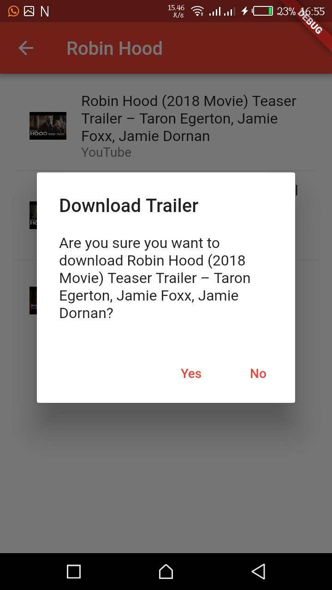

# FlutterTrailers 

A flutter App to download Movie Trailers.

## ScreenShots
  
  <!---->

## Requirements
* Any Operating System (ie. MacOS X, Linux, Windows)
* Any IDE with Flutter SDK installed (ie. IntelliJ, Android Studio, VSCode etc)
* A little knowledge of Dart and Flutter
* A brain to think 🤓🤓

## Usage
**Very Important**
[TMDB API](https://www.themoviedb.org) was used in making this app so make sure to read the [Documentation](https://www.themoviedb.org/documentation/api).

1. Fork and clone.
2. import project to your IDE.
3. Sync Gradle.
4. Start working.

## Author(s)
**Olusegun Festus Babajide**

## Contributors
**404 Not Found.**

Pull Requests are welcome if you fix any issues,
you can also open an issue.

## Disclaimer
This code is only intended for learning purposes, i am not responsible for anything you use it for.

Pardon my Bad English 😔

Give a ⭐️ if you like what you see.

## Getting Started
Still coding. To be ready in a few days lol